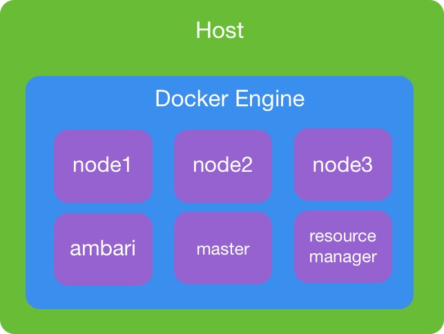

Dockerfiles and Docker Compose for setting up an multi-node HDP Cluster with Ambari 2.6. Docker images are based on Ubuntu 16.04. Optionally, you can boostrap HDP installation with Ambari blueprints.

Requires Docker > v1.13 and Docker Compose > v1.17

## Docker cluster layout


## Build images

1. Build HDP Base Image
```
cd hdp-base
docker build -t amarmesic/hdp-base:latest .
```

2. Build Ambari Agent Image
```
cd hdp-ambari-agent
docker build -t amarmesic/hdp-ambari-agent:latest .
```

3. Build Ambari Server Image
```
cd hdp-ambari-server
docker build -t amarmesic/hdp-ambari-server:latest .
```

## Run Docker Compose
To start containers, use Docker Compose
```
docker-compose up -d
```
It will take about a minute until Ambari is available on port 8080

## Optional: Install HDP 2.6 using Ambari Blueprints
Change the working directory to `blueprints`

1. Register blueprint
```
curl -H "X-Requested-By: ambari" -X POST -u admin:admin http://<AMBARIHOST>:8080/api/v1/blueprints/<CLUSTERNAME> -d @blueprint.json
```

2. Start deployment

Below comand will start cluster deployment

```
curl -H "X-Requested-By: ambari" -X POST -u admin:admin http://<AMBARHOST>:8080/api/v1/clusters/<CLUSTERNAME> -d @hosts.json
```

## Passwords

Admin/Database password for all services is `hadoop`

